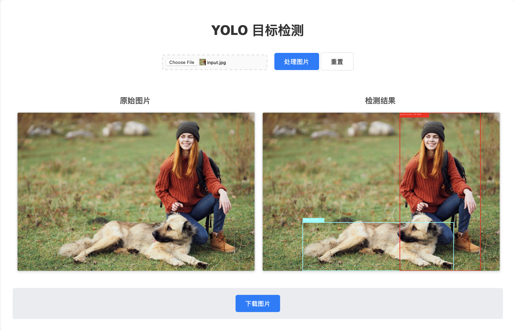

# YOLO 目标检测应用

这是一个基于 Tauri + Vue 3 + Rust 的 YOLO 目标检测桌面应用。使用 YOLOv10 模型进行实时图像目标检测，提供直观的用户界面和高效的处理性能。

## ✨ 功能特性

- 🖼️ **图像上传与预览**：支持选择本地图片文件并实时预览
- 🎯 **YOLO 目标检测**：集成 YOLOv10 模型进行高精度目标检测
- 📥 **结果下载**：处理完成后可下载检测结果图片
- 🔄 **重置功能**：一键重置所有状态，重新开始检测
- 💫 **实时反馈**：显示处理状态和成功提示
- 🚀 **高性能**：基于 Rust 的后端处理，提供快速的检测速度

## 📸 示例效果



*上图展示了原始图片（左）和经过 YOLO 目标检测处理后的结果（右），检测到了图片中的目标对象并用边界框标记。*

## 🛠️ 技术栈

- **前端**: Vue 3 + TypeScript + Vite
- **后端**: Rust + Tauri
- **AI 模型**: YOLOv10
- **框架**: Tauri (跨平台桌面应用)

## 📋 环境要求

- Node.js 18+
- Rust 1.70+
- 系统支持: Windows, macOS, Linux

## 🚀 安装与运行

### 1. 克隆项目

```bash
git clone <repository-url>
cd yolo-image-tauri
```

### 2. 安装前端依赖

```bash
npm install
# 或
pnpm install
```

### 3. 运行开发环境

```bash
npm run tauri dev
# 或
pnpm tauri dev
```

### 4. 构建生产版本

```bash
npm run tauri build
# 或
pnpm tauri build
```

## 📖 使用说明

1. **启动应用**：运行 `npm run tauri dev` 启动应用
2. **选择图片**：点击文件选择器选择要检测的图片
3. **处理图片**：点击"处理图片"按钮开始目标检测
4. **查看结果**：等待处理完成后查看检测结果
5. **下载结果**：点击"下载图片"按钮保存检测结果
6. **重置**：点击"重置"按钮清除所有状态重新开始

## 🏗️ 项目结构

```
yolo-image-tauri/
├── src/                    # Vue 前端代码
│   ├── App.vue            # 主应用组件
│   └── main.ts            # 前端入口文件
├── src-tauri/             # Tauri 后端代码
│   ├── src/
│   │   ├── main.rs        # Rust 主入口
│   │   ├── lib.rs         # Rust 库文件
│   │   └── commands.rs    # Tauri 命令处理
│   ├── Cargo.toml         # Rust 依赖配置
│   └── tauri.conf.json    # Tauri 配置
├── package.json           # Node.js 依赖配置
└── README.md              # 项目说明
```

## 🔧 开发环境配置

### 推荐 IDE 设置

- [VS Code](https://code.visualstudio.com/) + [Vue - Official](https://marketplace.visualstudio.com/items?itemName=Vue.volar) + [Tauri](https://marketplace.visualstudio.com/items?itemName=tauri-apps.tauri-vscode) + [rust-analyzer](https://marketplace.visualstudio.com/items?itemName=rust-lang.rust-analyzer)

### 开发命令

```bash
# 前端开发服务器
npm run dev

# Rust 代码检查
npm run tauri build

# 完整构建
npm run tauri build
```

## 📄 许可证

MIT License

## 🤝 贡献

欢迎提交 Issue 和 Pull Request 来改进这个项目！
